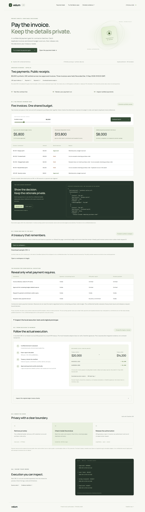
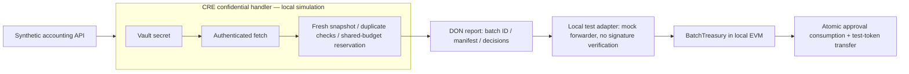

# Velum

**Private rules. Accountable payments.** A confidential batch-payment gate for crypto teams paying contractors, built for ETHOnline 2026.

[Live demo](https://velum.aethe.me) · [Persistent workspace](https://velum.aethe.me/#ledger) · [Sepolia receipts](public/sepolia-evidence.json) · [Actual CRE → local settlement receipt](public/settlement-evidence.json) · [Competitive review](docs/COMPETITIVE-REVIEW.md) · [Submission draft](docs/SUBMISSION.md)



Two invoices can each pass an approval limit and still exceed the same purchase order together. Velum evaluates an ordered payment batch inside a Chainlink CRE confidential handler, tracks the private budget remaining after each approval, and catches resubmitted invoices with different payment IDs. A minimal report authorizes exact payments without disclosing vendor names, purchase-order identifiers, approval limits or rejection reasons.

## Demonstrated result

In the synthetic five-invoice example, independent checks would pass $13,800. Batch-aware checks approve $5,800 and catch $8,000 of additional spending from shared-budget overcommitment and a duplicate invoice. These are fixture results, not customer savings.

`bun run test:e2e` compiles and deploys the treasury and a test token inside an EthereumJS EVM, starts an authenticated ephemeral fixture server, runs the **actual CRE CLI**, decodes its returned ABI payload, and submits that exact payload through a **mock forwarder caller**. Two approved payments move 5,800 synthetic USD; the treasury balance changes from 20,000 to 14,200. Failed transfers roll back authorization consumption. The resulting receipt and unedited CRE log are recorded.

The test adapter does **not** verify Chainlink report signatures. This demonstrates application integration across actual CRE simulation output and a local EVM, not live Chainlink network settlement or hardware attestation.

## What is implemented

- **Confidential CRE batch workflow:** `handlerInTee`, in-handler secret retrieval, authenticated HTTP, deterministic batch policy and one DON report.
- **Shared-budget evaluation:** ordered reservation within a batch, duplicate invoice identity checks, consistent policy snapshots, 120-second snapshot freshness, maximum 20 requests, one payment domain and token.
- **Treasury contract:** complete ordered manifest, exact payment commitments, forwarder/workflow authentication, one active batch, one-use request IDs, atomic ERC-20 transfer, replay protection, cancellation and expiry checks.
- **Interactive preview:** editable synthetic budget, per-invoice decisions, isolated-versus-batch comparison and operator/public disclosure views.
- **Evidence explorer:** actual local token balances, report SHA-256 consistency check, downloadable receipts and CRE logs.
- **Tests:** policy/API edge cases, original receiver tests, actual CRE-to-EVM integration, desktop/mobile browser flows and CI for checks that need no CRE credentials.

## Boundaries and trust

| Surface | What it actually does |
|---|---|
| Public browser preview | Ordinary server-side policy execution using synthetic data; never triggers CRE or payments. |
| CRE simulation | Executes the confidential handler locally; no real enclave privacy or hardware attestation. |
| Local EVM settlement | Runs actual Solidity bytecode and synthetic token transfers in memory. |
| Sepolia settlement | CRE CLI broadcast through a public mock forwarder and owner-pinned report adapter; synthetic tokens, no DON authentication or deployed TEE attestation. |
| Browser receipt hash | Detects mismatch between payload and the included hash; not proof of Chainlink signatures, authorship or independent attestation. |
| Accounting source | Trusted for invoice truth, policy authorization and snapshot accuracy. |
| Privacy | Private vendor/PO data and reasons do not enter the ABI report. Amounts, recipients, timing, decisions and public identifiers can still reveal information. Registration and settlement expose payment details. |

The persistent synthetic accounting workspace serializes reservations across runs using SQLite-backed Durable Objects. Canonical vendor/invoice identities remain reserved or paid across reloads. Finalized Sepolia receipts reconcile the recorded payments. The raw batch evaluator still uses a supplied snapshot; a production accounting integration must authenticate the organization, reserve its canonical source, and verify revocation before releasing any chain-bound reservation. `policyVersion` labels the private snapshot; it is not an onchain revocation mechanism. Cancellation is the explicit onchain revocation path. The policy is first-in-order, not an optimizer; the owner commits to the full ordering before report delivery.

CSV import and correction, persistent preview reservations, and reconciliation of the recorded Sepolia treasury are implemented. There is no accounting-provider integration or live confidential network deployment and no movement of real assets. The batch workflow also supports Sepolia broadcast through a separately deployed simulation adapter; see [the testnet reproduction guide](docs/SEPOLIA.md). The original single-invoice delivery path remains unverified. Use standard, known ERC-20 tokens only after further work: fee-on-transfer/rebasing tokens are not supported by the demonstrated accounting, and a token that falsely reports success is outside the trust assumptions. This prototype has not been audited. Never fund it with real assets or upload real invoices.

## Reproduce

Prerequisites: Node 22+, Bun 1.4.2, CRE CLI 1.33.0+ and browser login via `cre login` for CRE tests. SDK version is pinned to 1.18.0.

```sh
bun install --frozen-lockfile
cp .env.example .env
bun run typecheck
bun test
bun run test:contract
bun run test:e2e
```

The end-to-end command creates its own loopback-only API, temporary synthetic credential and local contracts; no faucet or wallet funding is required. Its private config/env artifacts are gitignored. The CLI needs your CRE login, but the script neither publishes that session nor uses it in the web app.

Run the interactive demo:

```sh
bun run dev
# Open http://127.0.0.1:8787
```

With that local server running:

```sh
bun run simulate:batch
bun run simulate
node --no-addons node_modules/@playwright/test/cli.js install chromium
bun run test:browser
```

`bun run test:e2e` regenerates `public/settlement-evidence.json`, `evidence/batch-e2e.json` and the batch log. Browser tests regenerate screenshots. Re-running evidence creates new timestamps and commitments. Node's `--no-addons` avoids incompatible optional native modules on the ARM64 development VM. Wrangler is pinned to 4.30.0 because newer native dependencies crashed there.

## Architecture



The manifest commits to the ordered payment commitments. Each commitment binds request ID, chain ID, treasury address, recipient, token, amount and expiry. Missing, reordered, tampered and replayed decisions are rejected by the treasury. The original single-request `InvoiceGate` remains as a smaller reference implementation.

## Source map

| Path | Purpose |
|---|---|
| `src/batch.ts` | Batch schema, private evaluation, report encoding and synthetic fixture |
| `workflow/batch-main.ts` / `batch-workflow/` | Actual confidential batch workflow and config |
| `contracts/BatchTreasury.sol` | Authenticated report receiver and atomic settlement |
| `contracts/TestToken.sol` | Unrestricted local test token, not production currency |
| `scripts/batch-e2e.ts` | Reproduce real CRE output → local Solidity execution |
| `src/policy.ts` / `workflow/workflow.ts` | Original single-invoice policy and CRE workflow |
| `src/worker.ts` / `public/` | Hosted demo API and browser UI |
| `test/`, `scripts/*test*`, `evidence/` | Checks, logs, receipts and screenshots |
| `docs/COMPETITIVE-REVIEW.md` | Assessment, rationale, limitations and sources |

## Attribution and team contribution

CRE API wiring was informed by the public [Hello Confidential Workflows template](https://github.com/smartcontractkit/cre-templates/tree/main/starter-templates/hello-confidential-workflows) and [consumer-contract documentation](https://docs.chain.link/cre/guides/workflow/using-evm-client/onchain-write/building-consumer-contracts). No prior private project code was reused. Project-specific work started September 11, 2026.

**AI disclosure:** Codex proposed and implemented the original concept, code, UI, tests and documentation. Lawrence chose Chainlink, provided the environment, authenticated CRE, reviewed the prototype, selected the name Velum and its mysterious/artistic brand direction, and requested a broader competitive/technical upgrade. Customer validation, registration-track confirmation and the human-narrated demo remain pending. This disclosure does not establish prize eligibility: [ETHOnline rules](https://ethglobal.com/events/ethonline2026/info/details) require meaningful team contribution and AI attribution. Planning artifacts are preserved in `docs/` and git history.


## Persistent accounting and privacy

The website now accepts a synthetic CSV (maximum 20 rows / 16 KB), supports editing
held rows, and saves isolated workspace ledgers across runs and reloads. Approval
limits and approved wallets are separate fixed synthetic policy records. Concurrent
reservations cannot overdraw the shared budget. Preview reservations can be released;
chain-bound reservations cannot be released from the UI.

Reconciliation verifies the canonical, finalized Sepolia receipt and exact treasury
payment event before marking an invoice paid. It is idempotent and trusts the
configured public RPC and test-token contract. The recorded example lets judges
resubmit a paid invoice and inspect why it remains blocked under a new request ID.

The authenticated snapshot endpoint also feeds the real CRE CLI simulation:
[ledger → CRE evidence](public/ledger-cre-evidence.json). After reconciliation, all
five sample requests are rejected. This uses the actual saved ledger, not a new
hardcoded fixture. Simulation still provides no hardware enclave protection.

Workspace access keys are random browser-held bearer capabilities; synthetic CSV
contents go to Cloudflare, outside any TEE. This is a demo tenant model, not production
identity management. Starting a separate workspace creates a separate ledger and
does not erase the previous one. See [accounting design](docs/ACCOUNTING.md).

Run `bun run types` before type checking on a fresh checkout. `bun run test:ledger-browser`
checks the deployed workspace, including real Sepolia reconciliation. Then
`bun run test:ledger-cre` tests the saved snapshot with an authenticated CRE CLI.
On this VM only, set `VELUM_TEST_IP=104.21.32.18` to work around its resolver; HTTPS
still validates the hostname. The Bun local fallback does not emulate Durable Objects.

Recording: [demo script](docs/DEMO-SCRIPT.md), [judge Q&A](docs/JUDGE-QA.md).
Customer research: [interview guide](docs/validation/INTERVIEW.md),
[unfilled findings](docs/validation/FINDINGS.md), [human review](docs/validation/HUMAN-REVIEW.md).
No customer validation or completed human narration is claimed.
