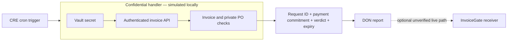

# Velum

Private invoice authorization using **Chainlink CRE Confidential Workflows**. An ETHOnline 2026 prototype built September 11, 2026.

**Demo:** https://velum.aethe.me · **[Execution evidence](public/evidence.json)** · **[Build spec](docs/BUILD-SPEC.md)** · **[Submission draft](docs/SUBMISSION.md)**


Velum checks confidential invoice and purchase-order details before generating a minimal payment authorization. The same deterministic policy powers an interactive demo and a real CRE `handlerInTee` workflow. Four recorded CRE CLI simulations produce an approval and three rejections. A Solidity receiver is independently tested in a local EVM.

## What works today
- Authenticated invoice API with synthetic vendor, invoice and purchase-order fixtures.
- In-handler secret retrieval and HTTP request using `TeeRuntime`.
- Private policy checks: positive exact amounts, vendor/PO/currency match, recipient/token match, per-invoice cap, remaining PO budget, paid status and expiry.
- `usingTheDons()` releases only an opaque request ID, payment commitment, approval boolean and expiry; `report()` generates a CRE report.
- `InvoiceGate` validates forwarder and workflow identity, matches the payment commitment and accepts a decision once. Approved requests can be consumed once by the treasury.
- Browser preview, mobile layout, recorded execution manifest and inspectable logs.

## What is not claimed
This is **simulation evidence**, not a deployment to the CRE network or a real hardware attestation. The browser preview runs normal server-side policy code and is not CRE execution. The receiver tests use an in-memory EthereumJS EVM with a mock forwarder caller. No contract is deployed to Sepolia and no money is transferred. `deliverOnchain` is implemented but unverified against a live forwarder and defaults to false. Placeholder token/consumer addresses are fixtures, not deployed contracts.

Do not send real invoices or credentials to this demo. Synthetic private fixtures are public in source code. The deployed preview uses no CRE credentials. Local simulation cannot protect sensitive values from the local host.

## Run locally
Prerequisites: Node 22+, Bun, CRE CLI 1.33.0+, and a CRE account authenticated with `cre login`. The tested SDK is 1.18.0.

```sh
bun install --frozen-lockfile
cp .env.example .env
bun run dev
```

Open http://127.0.0.1:8787. In another terminal:

```sh
bun run typecheck
bun test test/policy.test.ts
bun run test:contract
bun run simulate
cre workflow simulate workflow --target staging-settings --non-interactive --trigger-index 0 --config workflow/config.over-limit.json
cre workflow simulate workflow --target staging-settings --non-interactive --trigger-index 0 --config workflow/config.wrong-recipient.json
cre workflow simulate workflow --target staging-settings --non-interactive --trigger-index 0 --config workflow/config.duplicate.json
```

Browser verification (with the local server running):

```sh
node --no-addons node_modules/@playwright/test/cli.js install chromium
bun run test:browser
```

Node's `--no-addons` avoids incompatible optional native modules on the development ARM64 VM. Contract tests use EthereumJS's JavaScript implementation. Wrangler is pinned to 4.30.0; newer native dependencies crashed on this VM.

## Confidentiality boundary



The payment commitment binds request ID, chain ID, receiver, recipient, token, amount and expiry using ABI encoding and keccak256. It does not contain vendor IDs or PO numbers. Amounts and recipients are not made private by this design: registration and eventual payment expose them onchain. Source code and deployed workflow binaries are also public. Detailed rejection reasons remain in the confidential handler; only the synthetic public preview displays them.

## Trust and remaining engineering
The invoice API is trusted for invoice correctness, vendor policy and already-paid flags. This prototype has no accounting connector or transactional reservation of PO budgets: concurrent approvals could collectively exceed a shared budget. Before real payments, integrate atomic accounting reservations, stable invoice IDs, freshness/version binding and reconciliation with the treasury. Enclave attestation does not prove an upstream invoice is truthful.

`InvoiceGate` is a registry, not a payment vault. A treasury integration must consume authorization and transfer assets atomically. No audit has been performed. To use live delivery, deploy a receiver with the documented Chainlink forwarder and the exact authorized workflow identity, replace all fixture addresses, align API request data with a registered request, use a dedicated funded testnet signer and verify the full report delivery. Network Confidential Workflows require access approval.

## Source map
- `workflow/`: actual confidential CRE workflow and scenario configs.
- `src/policy.ts`: shared validated policy and report encoding.
- `src/worker.ts`: Cloudflare Worker API; `public/`: browser demo.
- `contracts/InvoiceGate.sol`: authenticated one-use authorization receiver.
- `scripts/contract-test.ts`, `test/policy.test.ts`, `scripts/browser-test.mjs`: executable checks.
- `evidence/`: recorded simulation logs, local EVM/browser results and screenshots.
- `docs/`: original scope, attribution, submission draft and demo script.

## Attribution and eligibility
The CRE wiring was adapted from the public [Hello Confidential Workflows](https://github.com/smartcontractkit/cre-templates/tree/main/starter-templates/hello-confidential-workflows) template and [consumer-contract documentation](https://docs.chain.link/cre/guides/workflow/using-evm-client/onchain-write/building-consumer-contracts). Invoice policy, receiver and UI were created for this prototype; no prior private project code was reused.

**AI disclosure:** Codex proposed the product and generated the implementation, UI, tests and documentation. Lawrence chose the Chainlink track, provided the development environment and completed CRE authentication. Customer validation, human product contributions, track confirmation and a human-narrated demo are still pending. Do not submit this as an entirely human-built project or claim that those contributions occurred. [ETHOnline rules](https://ethglobal.com/events/ethonline2026/info/details) require meaningful team contributions and AI attribution.
